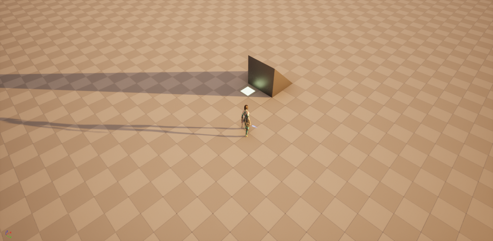

# HackAndSlashTemplate
This is an Unreal Engine 5.1 project template that may help creating an action rpg / hack and slash type game with isometric view and Gameplay Abilities plugin (https://github.com/tranek/GASDocumentation).

### Usage
Feel free to use this when making a Hades / Enter the Gungeon type project.
The main point are the two ACharacter-derived classes - Entity and its derivative, Playable. Entity is set up with fully working GAS, suitable for playable and nonplayable pawns alike, while Playable has the added benefit of camera and movement components. Your Playable will move with WASD while rotating towards a cursor that renders on the world surface in real time.

### If you want to use the code from here, but not download the project itself, make sure to:
1. Enable Gameplay Abilities plugin in your project.
2. Add:  
	- PrivateDependencyModuleNames.AddRange(new string[] { "GameplayAbilities", "GameplayTags", "GameplayTasks" });
 
	in Source/[Project Name]/[Project Name].build.cs
3. Create a C++ class derived from UAssetManager and set it up like UHNSTAssetManager here.
4. Add:  
	- AssetManagerClassName=/Script/[Project Name].[Asset Manager Class Name], e.x. AssetManagerClassName=/Script/HackAndSlashTemplate.HNSTAssetManager
 
	in Config/DefaultEngine.ini, as the last line of [/Script/Engine.Engine] section.
5. Create a UENUM of Ability Inputs in [Project Name].h. Look at HackAndSlashTemplate.h for reference.
6. Create axis mappings for movement and action mappings for abilities in your project settings.
7. Create a new Game Mode Base blueprint class, override the default player state and player controller with our custom classes and set it as default in your project settings.
8. Create a new Gameplay Effect blueprint class where you set the default attributes and use it in your desired actor under Default Attributes field.

To check if GAS works properly, spawn and posses your actor, press '~' on your keyboard and type AbilitySystem.DebugBasicHUD. You should see all your attributes set with their values.

Be sure to create abilities from your own, custom class and not from the default GameplayAbility class.

Have fun!

### License

BSD 2-Clause License

Copyright (c) 2023, Marcin Gałąska  
All rights reserved.

Redistribution and use in source and binary forms, with or without
modification, are permitted provided that the following conditions are met:

* Redistributions of source code must retain the above copyright notice, this
  list of conditions and the following disclaimer.

* Redistributions in binary form must reproduce the above copyright notice,
  this list of conditions and the following disclaimer in the documentation
  and/or other materials provided with the distribution.
